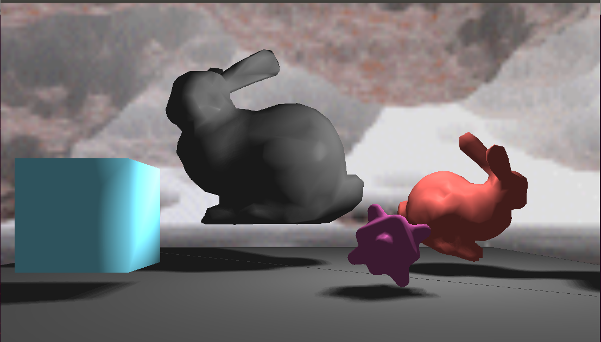
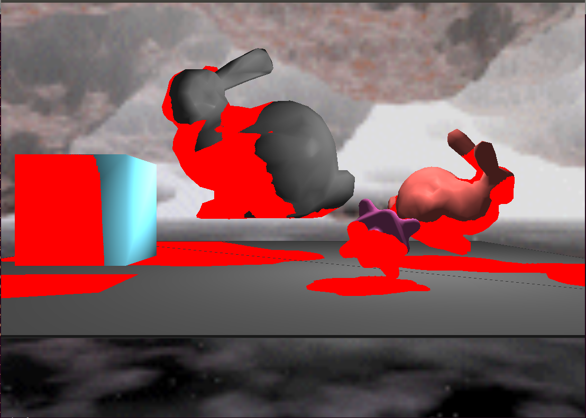
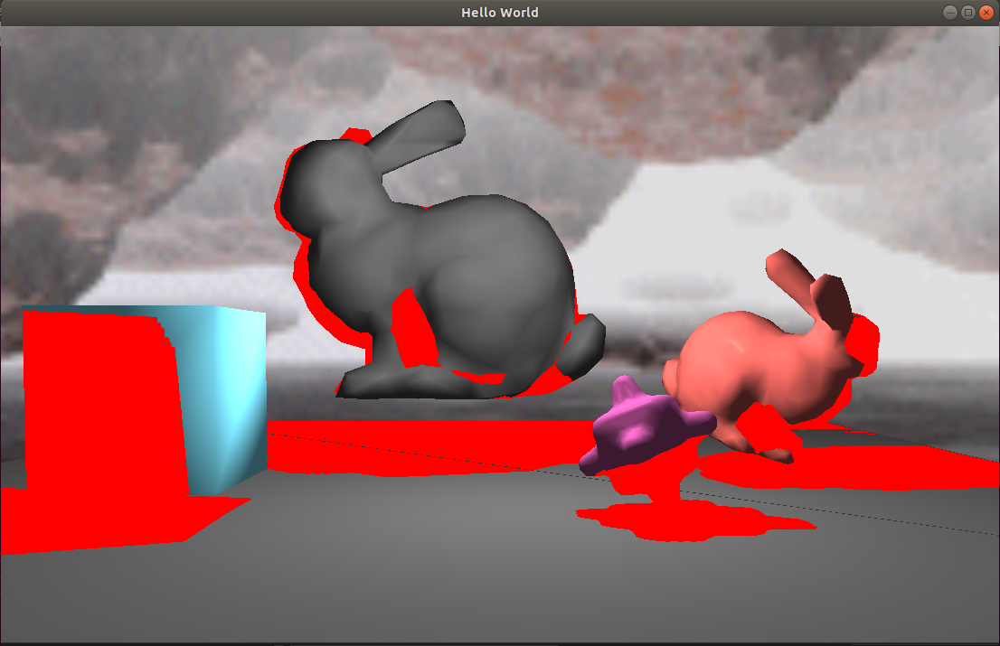
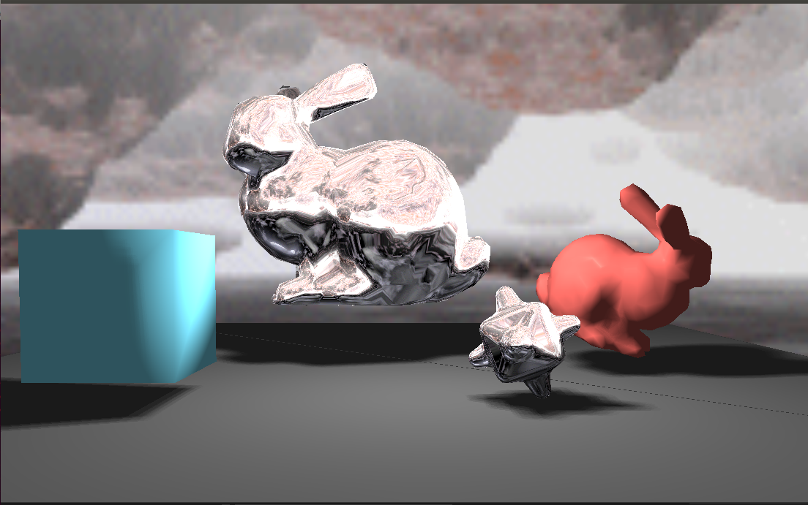
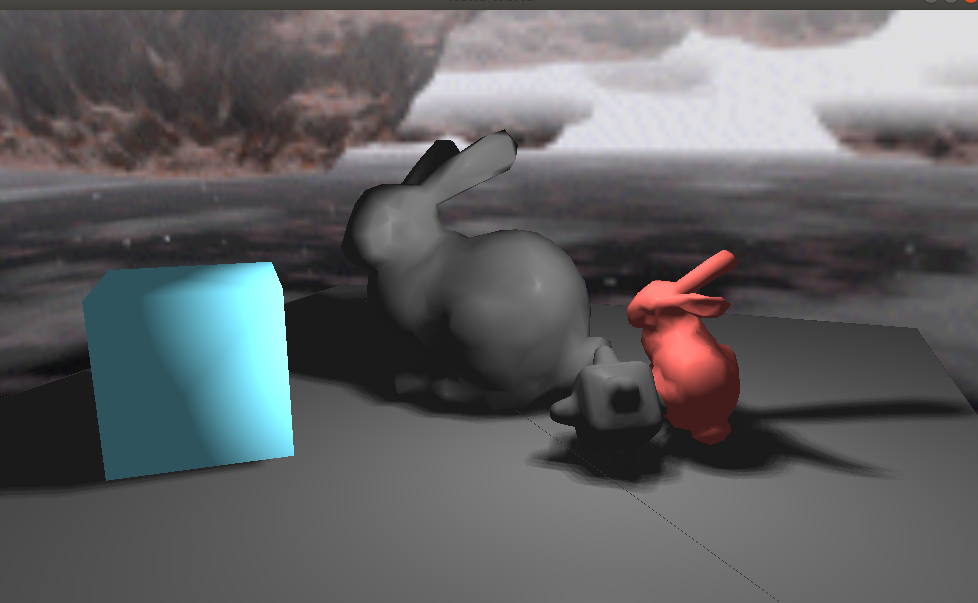
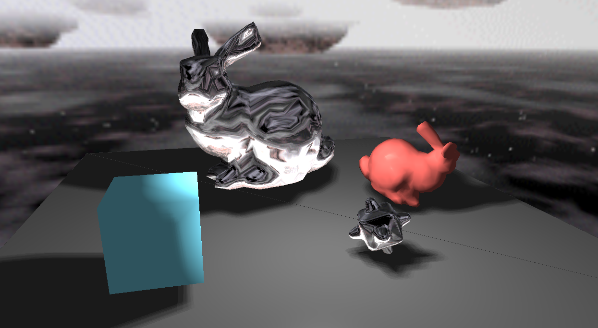
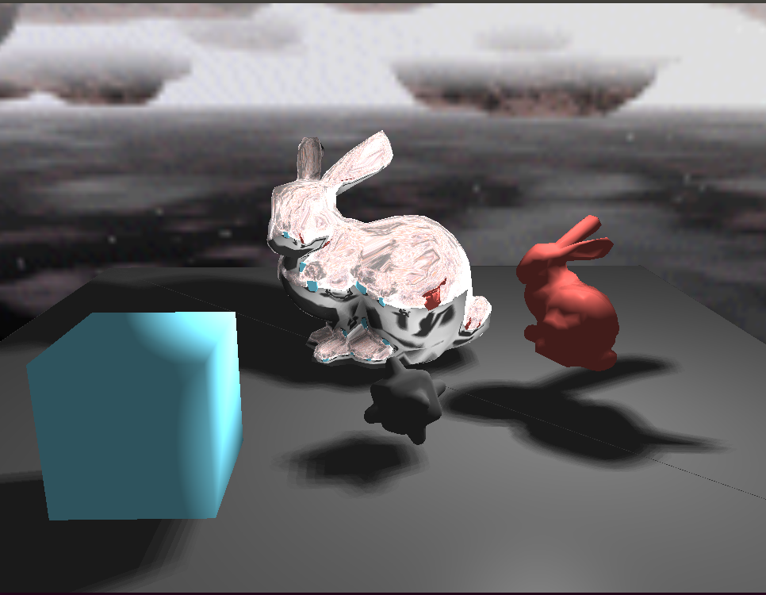

# 3D Scene Editor

## Operations

### 1.1 Shadow Mapping
1. Insert Mode
    - Press 'i' to enter insert mode
    - Load prepared object by pressing '1','2','3'

2. Move Mode
    - Press 'o' to enter move mode
    - Use 'w' 'a' 's' 'd' 'q' 'e' to Translate the object via xyz axis
    - Use 'f' 'g' 'h' 'j' 'k' 'l' to Rotate the object through xyz axis
    - Use ',' '.' to scale the object
   

3. Light Mode
   - Press 'y' to enter light mode
   - Press 's' to make the shadow red
   
   - Press 'a' and 'd' to move the light in a circle
   

### 1.2 Environment Mapping
   - In move mode, press 'v' to make the object mirror shading, press 'c' to resume phong shading
   - Skybox: completed
   

### 1.3 Camera Control
1. Camera Mode
    - Press 'u' to enter camera mode
    - Use 'w' 's' 'a' 'd' 'q' 'e' to move the camera
        

### Optional
1. Refraction
   - In the move mode, press 'b' to make the object refraction shading
   
2. Dynamic environment mapping
   - In the move mode, press 'b' to make the object dynamic mirror shading
   
   


```
Report ends here, texts below are report for Assignment3
```


### Open the application editor


### 1.1 Scene Editor
1. Insert Mode
    - Press 'i' to enter insert mode
    - Load prepared object by clicking
        - Draw cube
            
        - Draw bumpy cube
            
        - Draw bunny
            

2. Delete Mode
    - Press 'p' to enter delete mode
        

### 1.2 Object Control
1. Move Mode
    - Press 'o' to enter move mode
    - Use 'w' 'a' 's' 'd' 'q' 'e' to Translate the object via xyz axis
    - Use 'f' 'g' 'h' 'j' 'k' 'l' to Rotate the object through xyz axis
    - Use 'n' 'm' to scale the object
        


2. Shading Model
    - In the move mode, we can change shading model and color of the object
    - Use '1' to '9' to change the object color
    - Use 'z' 'x' 'c' to change the object to wireframe, flat, phong, shading model
        

### 1.3 Camera Control
1. Camera Mode
    - Press 'u' to enter camera mode
    - Use 'w' 's' 'a' 'd' 'q' 'e' to translate the camera
        

2. Projection
    - Press 'n' and 'm' to swithc between orthographics projection and perspective projection in camera mode
        
        


### 1.5 Trackball
1. Trackball
    - Use 'z' 'x' to swtich the camera between trackball mode and normal mode

### 1.6 Blobby Man
See blobby_man branch